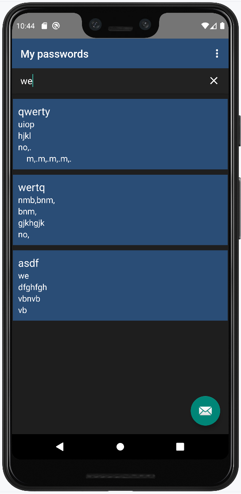

# Password Manager
### by Wizand0

The application is completely offline and does not require permissions to access the network.

Initial start. Authorization

v1.2.5 no filds encryption. + PasswordGenerator with copy password to clipboard

## Screenshots

Logo           |         Recycler view
:-------------------------:|:------------------------------:
  | 

Edit pass in DB         |  Password generator
:-------------------------:|:------------------------------:
 |  

## TODO
- ~~User authorization~~
- ~~salt in method~~
- Eccrypt password field in DB
- ~~Class for password generator~~
- ~~Initial activation for the initial setup~~
- ~~Menu~~
- ~~Password generator~~
- Secured Shared Preferences
- Bottom menu
- SQLite fields encryption
- Custom fields for data entry
- beautiful and user-friendly UI

## Very long-term TODO
- exporting a database
- importing a database

## Skills
- Java
- Room Database
- SQLite
- RecyclerView

## Credits
java-aes-crypto - https://github.com/tozny

## Versions
- v1.2.5 no filds encryption. + PasswordGenerator with copy password to clipboard
- v1.2 - refactoring
- v1.1 - authorization, login activity, encryption for passsword
- v0.8b - initial activation
- v0.6b - Basic functionality
